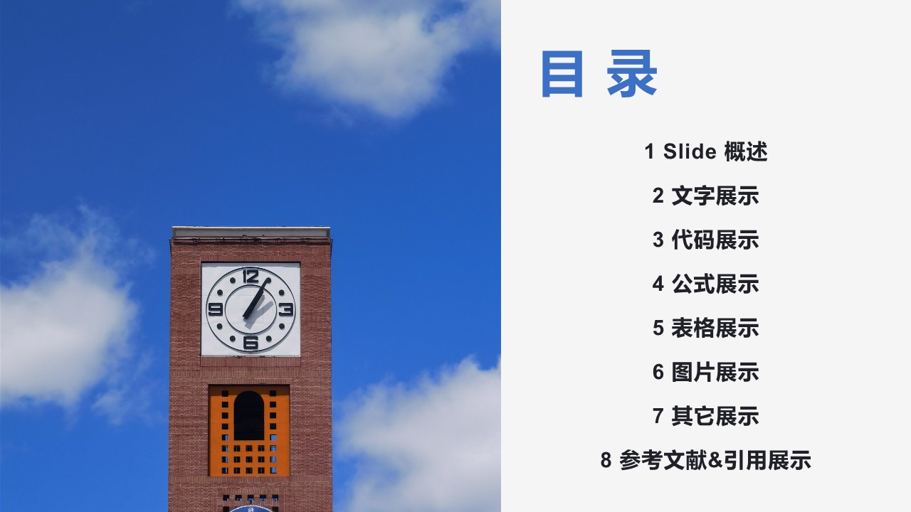
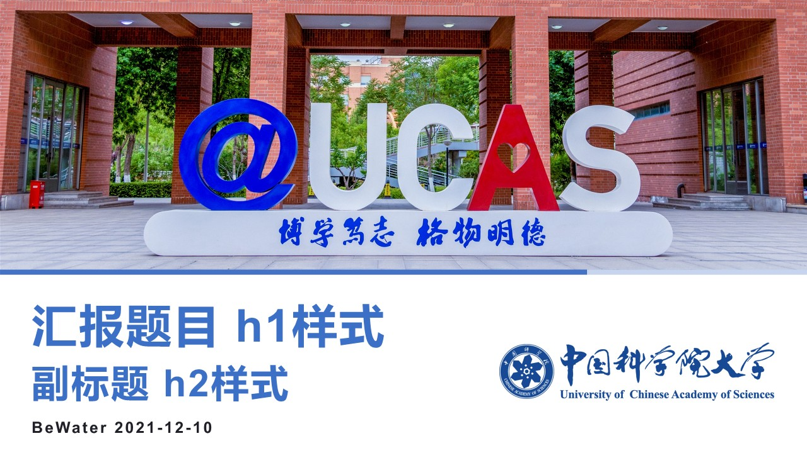

# Marp-Theme-UCAS 国科大Marp 主题

> 如何使用Markdown做PPT?本仓库是利用Marp实现的国科大markdown Slides

这是为国科大设计的两款 [Marp](https://github.com/marp-team/marp) 主题.

如果你想要使用这两款主题，强烈建议你先看一下生成的pdf文件。

更多使用细节，可以点击 [link](https://mdnice.com/writing/9cb2de742bed48d0b131e35d653515f2)

如果你想自定义Marp主题，可以看一下这篇教程 [link](https://zhuanlan.zhihu.com/p/449668027)

## File structure

```bash
Marp
  |__ .vscode
  |     |__settings.json   //主题配置文件
  |__ doc
  |     |__Scenery        //Scenery.md 生成的PPT图片
  |     |__SimpleBlue     //SimpleBLue.md 生成的PPT图片
  |     |__Scenery.pdf    //Scenery.md 导出的Pdf
  |     |__SimpleBlue.pdf //SimpleBlue.md 导出的Pdf
  |__ images              //文稿和主题所用到的图片文件 可对背景和logo进行替换
  |__ themes
  |     |__UCASSce.css    //UCASSce主题文件
  |     |__UCASSimple.css //UCASSimple主题文件
  |__Scenery.md           //UCASSce主题对应的md文件
  |__SimpleBlue.md        //UCASSimple主题对应的md文件
```

## Some Picture





