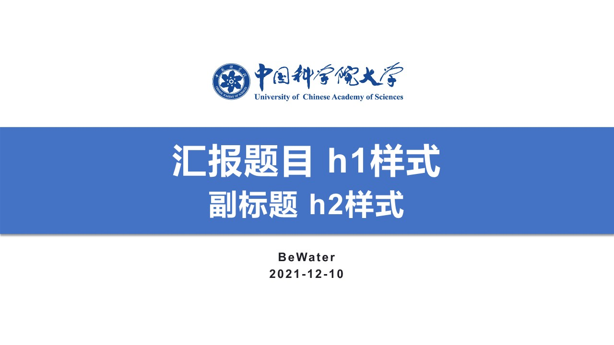
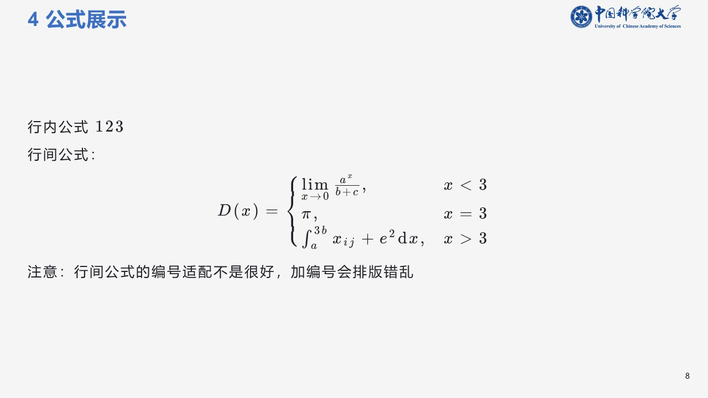

# Marp-Theme-UCAS
These are two Marp themes designed for students of UCAS.

if you want to use it , I strongly recommend that you check the generated pdf file first.

More details ，click [here](https://mdnice.com/writing/9cb2de742bed48d0b131e35d653515f2)

## File structure

```bash
Marp
  |__ .vscode
  |     |__settings.json   //主题配置文件
  |__ doc
  |     |__Scenery        //Scenery.md 生成的PPT图片
  |     |__SimpleBlue     //SimpleBLue.md 生成的PPT图片
  |     |__Scenery.pdf    //Scenery.md 导出的Pdf
  |     |__SimpleBlue.pdf //SimpleBlue.md 导出的Pdf
  |__ images              //文稿和主题所用到的图片文件 可对背景和logo进行替换
  |__ themes
  |     |__UCASSce.css    //UCASSce主题文件
  |     |__UCASSimple.css //UCASSimple主题文件
  |__Scenery.md           //UCASSce主题对应的md文件
  |__SimpleBlue.md        //UCASSimple主题对应的md文件
```

## Some Picture






