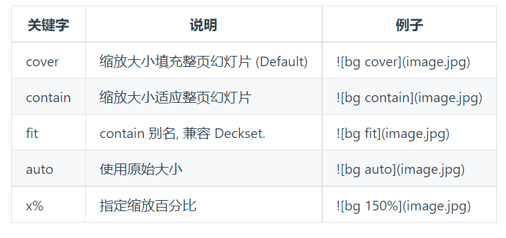

<style scoped>
    section {
  text-align: center;
    }
</style>

<!--
_backgroundImage: url("./images/bg1.jpg")
_paginate: false 
-->


# 汇报题目 h1样式
## 副标题 h2样式

**BeWater**
**2021-12-10**


---
<style scoped>
    section {
  text-align: center;
    }
    h1 {
        color: rgb(60, 112, 198);
        margin-bottom: 30px;
    }
    h6 {
        text-align: center;
    }

</style>
<!--
_paginate: false 
-->


# 目 录

###### 1 Slide 概述
###### 2 文字展示
###### 3 代码展示
###### 4 公式展示
###### 5 表格展示
###### 6 图片展示
###### 7 其它展示
###### 8 参考文献&引用展示
 
---
<!-- _header: 1 Slide概述 -->

本PPT借助插件Vscode插件Marp书写而成，由markdown文档编辑，方便公式和代码的展示与排版。

**环境：**
- 系统：Win10
- 软件：VsCode 插件：Marp
- theme：自定义主题 UCASSimple ，基于官方uncover主题修改
  
**特征：**
- 背景选用简约蓝色背景，每页上方标题栏基于Marp header格式进行修改而成。
- 首尾页和目录页蓝色色块基于背景得到，首尾页可根据文字内容在本页修改标题样式，目录页可根据文字内容对色块进行大小位置调整

---
<!-- _header: 2 文字展示 -->
**h1 h2 只在首页应用 h6 只在目录页应用**
### h3 标题文字
#### h4 标题文字
**加粗文字**
普通文字
*斜体文字*
~~删除线~~


---
<!--_header: 3 代码展示 -->

### 行内代码展示
行内代码展示 `this is a code`

### 代码块展示
**python code**

``` python
# python code 
import torch

def Net()

```
---
<!--_header: 3 代码展示 -->

**C++ code**
``` C++
//c++ code 
#include<iostream.h>
#include<string.h>
using namespace std;

int main(
    cout<<"hello world!";
    return 0;
)

```
---
<!--_header: 4 公式展示 -->

行内公式 $123$

行间公式：

$$

D(x) = \begin{cases}
\lim\limits_{x \to 0} \frac{a^x}{b+c}, & x<3 \\
\pi, & x=3 \\
\int_a^{3b}x_{ij}+e^2 \mathrm{d}x,& x>3 \\
\end{cases} 

$$

注意：行间公式的编号适配不是很好，加编号会排版错乱

---
<!--_header: 5 表格展示 -->

|  表头   | 表头  | 表头 |
|  ----  | ----  |--- |
| 单元格  | 单元格 |单元格|
| 单元格  | 单元格 |单元格|

---
<!--_header: 6 图片展示 -->
### 普通图片
图片滤镜命令

|


---

<!--_header: 6 图片展示 -->
### 背景图片



---
<!--_header: 7 其它展示 -->
一些表情

:+1: :-1: :smile: :heart: :cry: :sob: :a: :b: :angry: :grin: :tongue: :ru: :us: :cn:

---
<style scoped>   
    h3 {
        text-align:center;
        margin-bottom: 50px;
    }
</style>
### 一些参考& 进一步阅读

> Marp 官方文档 [link](https://marpit.marp.app/markdown)
> 分栏显示  [link](https://github.com/marp-team/marp/discussions/192)
> Marp VSCode教程 [link](https://github.com/marp-team/marp-vscode)
> CAI Marp详细教程博客 [link](https://caizhiyuan.gitee.io/categories/skills/20200730-marp.html#%E5%8A%9F%E8%83%BD)
> theme gaia 源代码 [link](https://github.com/marp-team/marp-core/blob/main/themes/gaia.scss)
> theme uncover 源代码 [link](https://github.com/marp-team/marp-core/blob/main/themes/uncover.scss)

---
<style scoped>
    section {
  text-align: center;
    }
    h1{
        margin-top: 100px;
        margin-bottom: 100px
    }
</style>

<!--
_backgroundImage: url("./images/bg1.jpg")
_paginate: false 
-->


# 请各位老师批评指正


**BeWater**
**2021-12-10**

